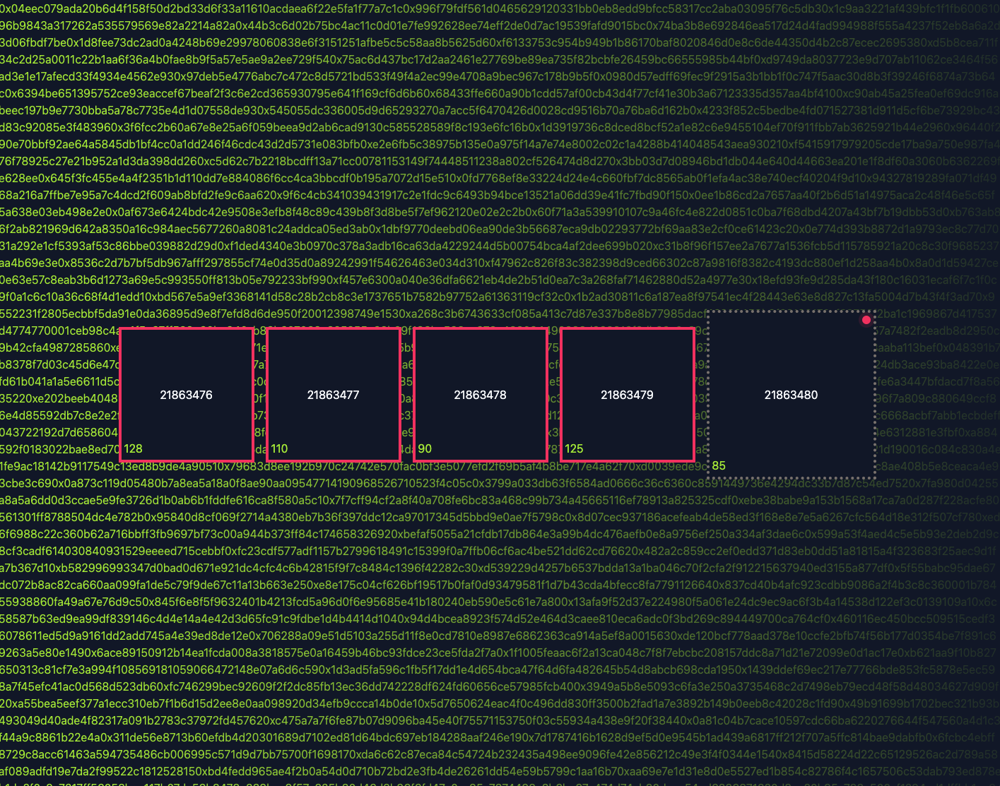

This is a [Next.js](https://nextjs.org/) project bootstrapped with [`create-next-app`](https://github.com/zeit/next.js/tree/canary/packages/create-next-app).



Small app which shows last mined Blocks in real time on BSC and its transactions in background.

## Getting Started

First, run the development server:

```bash
npm run dev
# or
yarn dev
```

Open [http://localhost:3000](http://localhost:3000) with your browser to see the result.

You can use this as template/reference to integrate next with other libs.

## This example includes

- Next / React / Typescript
- Redux + @reduxjs/toolkit
- Ethers via WS and HTTP 
- TailWind CSS 3
- Atomic Design
- Quicknode as provider

